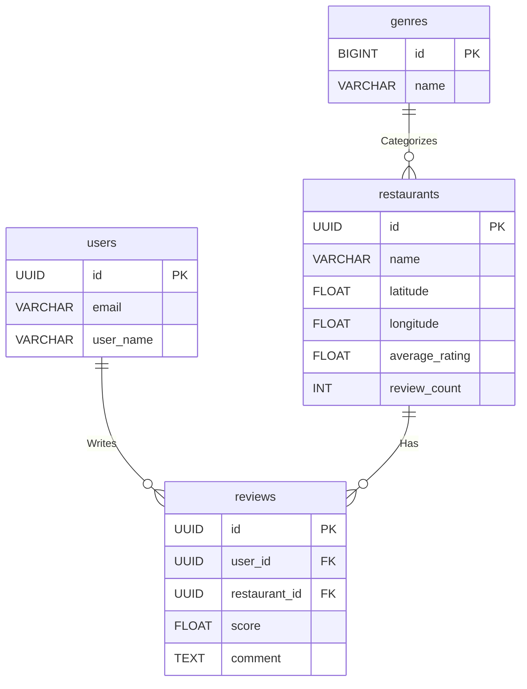

### テーブル構造

## users

| id          | email            | hashed_password | user_name   | created_at | updated_at |
| ----------- | ---------------- | --------------- | ----------- | ---------- | ---------- |
| UUID        | VARCHAR(255)     | VARCHAR(255)    | VARCHAR(50) | TIMESTAMP  | TIMESTAMP  |
| Primary Key | UNIQUE, NOT NULL | NOT NULL        | NOT NULL    | NOT NULL   | NOT NULL   |

## restaurants

| id          | name         | address      | latitude | longitude | genre_id    | average_rating | review_count | created_at | updated_at |
| ----------- | ------------ | ------------ | -------- | --------- | ----------- | -------------- | ------------ | ---------- | ---------- |
| UUID        | VARCHAR(100) | VARCHAR(255) | FLOAT    | FLOAT     | BIGINT      | FLOAT          | INT          | TIMESTAMP  | TIMESTAMP  |
| Primary Key | NOT NULL     | NOT NULL     | NOT NULL | NOT NULL  | Foreign Key | Default 0      | Default 0    | NOT NULL   | NOT NULL   |

## reviews

| id          | user_id     | restaurant_id | score    | comment | visit_date | created_at | updated_at |
| ----------- | ----------- | ------------- | -------- | ------- | ---------- | ---------- | ---------- |
| UUID        | UUID        | UUID          | FLOAT    | TEXT    | DATE       | TIMESTAMP  | TIMESTAMP  |
| Primary Key | Foreign Key | Foreign Key   | NOT NULL | NULL    | NULL       | NOT NULL   | NOT NULL   |

## genres

| id          | name             | created_at | updated_at |
| ----------- | ---------------- | ---------- | ---------- |
| BIGINT      | VARCHAR(50)      | TIMESTAMP  | TIMESTAMP  |
| Primary Key | UNIQUE, NOT NULL | NOT NULL   | NOT NULL   |

### ソート・絞り込み機能

| ソート種別           | 概要                                   | 技術的実装 / DB 処理                                                                                          |
| :------------------- | :------------------------------------- | :------------------------------------------------------------------------------------------------------------ |
| **現在地から近い順** | ユーザーの現在位置から近い店舗順に表示 | `restaurants`テーブルの`latitude`/`longitude`と、Geolocation API で取得した現在地を用いて距離を計算しソート。 |
| **評価が高い順**     | ユーザー評価の平均点が高い順に表示     | `restaurants`テーブルの`average_rating`カラムを用いて`ORDER BY DESC`で取得。                                  |
| **口コミ数が多い順** | 口コミの投稿数が多い順に表示           | `restaurants`テーブルの`review_count`カラムを用いてソート。                                                   |
| **登録が新しい順**   | マイページへの登録日時が新しい順に表示 | `reviews`テーブルの`created_at`を用いて、ユーザーごとの履歴を時系列順に取得。                                 |

### ER 図

